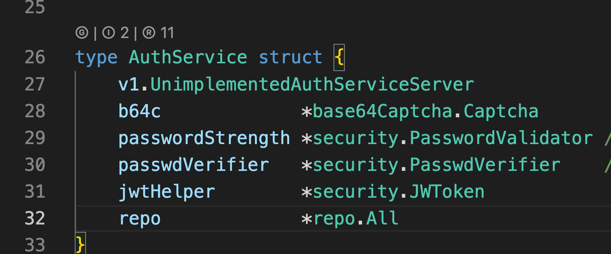

# Go++

中文文档 [README_zh.md](README_zh.md)

Go++ is a VS Code extension designed to enhance Go development workflow by improving interface navigation and dependency management, making your Go coding experience more productive and efficient.

## Core Features

- **Interface Navigation**: Automatically detect and provide visual links between struct methods and interfaces
- **Go Dependency Management**: Visualize project dependencies with source code browsing and version management
- **Quick Run & Debug**: One-click execution and debugging for main functions with parameter support
- **Code Translation**: Multi-engine comment translation for international development teams



Ⓖ - Generate code button
Ⓘ - Interface implementation button
Ⓡ - References button


Click Ⓖ Generate code button to:

1. Generate interface methods (interface names can be 🔍 searched, unlike the official tool)
2. Generate struct tags, specifying tag name and format (camelCase or snake_case)
3. Generate options pattern code
4. Generate unit tests


* Run - Execute directly using saved parameters
* Debug - Debug directly using saved parameters
* Args - Set parameters and save them for Run and Debug operations

Go Libraries tree view:


1. When navigating to source code, the relevant file automatically expands
2. Cmd + click on import statements will also automatically expand the corresponding directory

Translation feature:


1. Translate selected text (select text then click the lightbulb to choose translation)
2. Automatic comment translation (useful for reading source code, with caching to conserve free translation quotas)

Translation configuration:


Supports Tencent Translator, ByteDance Volcano Translator, Microsoft Translator (unverified), and Google Translate (unverified)

For bugs or feature ideas, please provide feedback.

Click on the bottom left -> Report Issue -> Brief description -> Authorize GitHub
This will automatically submit an issue:


The animation demonstrates the seamless navigation experience:

1. Starting from a struct implementation and finding which interfaces it implements
2. Navigating from an interface definition to view all its implementing structs
3. Jumping from a method in a struct directly to its corresponding interface method
4. Finding all implementations of an interface method across different structs

## Usage

### Interface Navigation

When implementing interface methods, Go++ automatically displays corresponding interface links above the method. Click to navigate to the interface definition. Supports multiple interface implementations - all relevant interfaces are listed when a method implements several interfaces.

### Dependency Management

Expand the "Go Library" panel in the VS Code explorer to view:

- Direct/indirect dependencies
- Replaced and excluded modules
- Tools and standard library

Right-click menu supports operations like tidy, update, and source code download.


## Requirements

- VS Code 1.84.0+
- Go development environment
- Go extension (ms-vscode.go)

## Technical Implementation

Go++ is built on these core technologies:

### Interface Navigation

- CodeLens API for displaying navigation buttons
- AST analysis for identifying interface implementations
- Multi-level caching to prevent redundant parsing

### Dependency Management

- Custom tree view for module relationship visualization
- WebAssembly acceleration for complex module parsing
- Smart path resolution supporting both GOMODCACHE and GOPATH

### Performance Optimizations

- Lazy loading to reduce initialization time
- Debouncing techniques for high-frequency operations
- File system watchers for minimal updates

## Project Structure

```

gopp/
├── docs/                    # Documentation
├── resources/               # Icons and resources
├── src/
│   ├── core/                # Core implementations
│   │   ├── library/         # Dependency management
│   │   ├── translation/     # Translation features
│   │   └── home/            # Settings UI
│   ├── pkg/                 # Utilities
│   └── extension.ts         # Entry point
└── test/                    # Test files

```

## Contributing

Issues and Pull Requests are welcome to improve Go++. For problem reporting, use the built-in feedback form (supports automatic environment info collection).

## License

MIT
```
