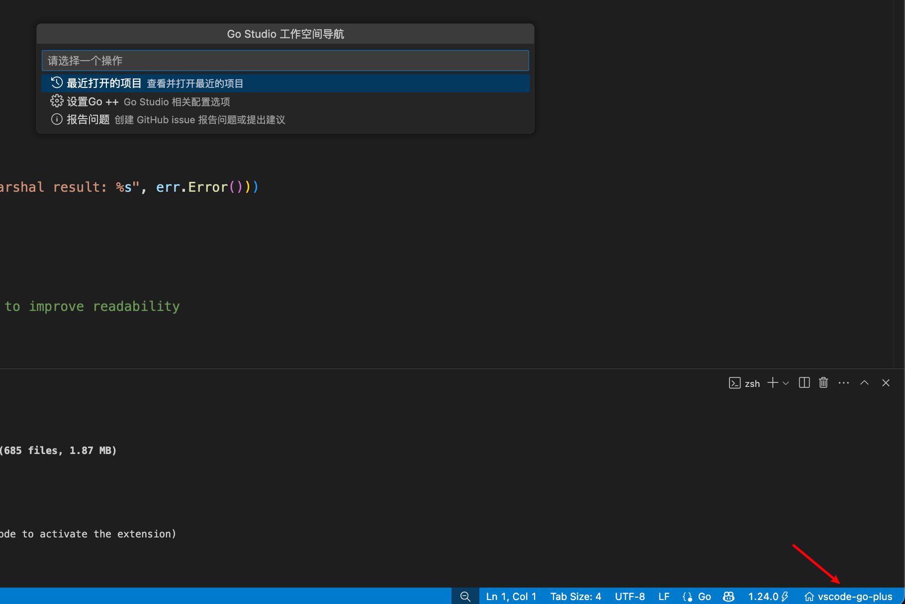

# Go++

*English documentation: [README.md](README.md)*

Go++ 是一个专为 Go 开发者打造的 VS Code 扩展，大幅提升接口实现导航体验并优化模块依赖管理，让你的 Go 开发流程更加顺畅高效。

## 核心功能

- **接口实现导航**：自动识别结构体方法与接口的实现关系，提供即时可视化链接
- **Go 依赖管理**：直观呈现项目依赖关系，支持源码浏览与版本管理
- **一键运行调试**：为 main 函数提供即时运行、调试功能，支持参数保存
- **代码翻译**：提供多引擎支持的代码注释翻译功能


Ⓖ - Generate code button 生成代码按钮

Ⓘ - Interface implementation button 接口实现按钮

Ⓡ - References 引用按钮


点击 Ⓖ 生成代码按钮

1. 可以生成接口方法（接口名可以🔍搜索， 官方的不支持搜索😢）
2. 生成结构体标签，指定标签名，值是驼峰还是下划线。
3. 生成 options 选项模式。
4. 生成单元测试。


* Run - 直接运行，使用保存的参数
* Debug - 直接调试，使用保存的参数
* Args - 设置参数并保存，供 Run 和 Debug 使用

Go Libraries 树


1. 代码跳转到源码的时候会自动展开对应的文件。
2. cmd + 点击 import 的位置也会自动展开对应的目录。


翻译功能


1. 选中翻译文本（选中文本后点击小灯泡选择翻译）
2. 注释自动翻译（哈哈，看源码不慌，但是翻译字符量大，小心免费额度不够用， 也做了缓存处理）

翻译配置


支持 腾讯翻译君、字节火山翻译、微软翻译（没验证）、google 翻译（没验证）

有bug请反馈，有什么新点子的功能也可以留言。

点击左下角 -> 报告问题 -> 简单描述  -> 授权github 

就会自动提交到 issue



### 接口导航

在实现接口方法时，Go++ 自动在方法上方显示对应接口链接，点击即可跳转至接口定义。支持多接口实现场景，同一方法实现多个接口时均会列出。

### 依赖管理

在 VS Code 资源管理器中展开 "Go Library" 面板，可查看：

- 直接/间接依赖关系
- 替换(replace)和排除(exclude)模块
- 工具依赖和标准库

右键菜单支持 tidy、update、下载源码等操作。

### 快捷键

| 功能                     | 快捷键               |
| ------------------------ | -------------------- |
| 聚焦/退出 Go Library     | Ctrl(⌘) + Shift + ' |
| 在编辑器中显示当前依赖项 | Ctrl(⌘) + Shift + / |
| 折叠 Go Library          | Ctrl(⌘) + Shift + . |

## 代码示例

```go
// 定义接口
type Greeter interface {
    SayHello() string
    SayGoodbye() string
}

// 实现类
type EnglishGreeter struct{}

// 此处会显示到 Greeter 接口的链接
func (g *EnglishGreeter) SayHello() string {
    return "Hello!"
}
```

## 系统要求

- VS Code 1.84.0+
- Go 开发环境
- Go 扩展 (ms-vscode.go)

## 技术实现

Go++ 基于以下核心技术构建：

### 接口跳转功能

- 使用 CodeLens API 展示导航按钮
- 通过 AST 分析识别接口实现关系
- 多级缓存策略避免重复解析

### 依赖管理

- 自定义树视图呈现模块关系
- WebAssembly 加速解析复杂模块结构
- 智能路径解析同时支持 GOMODCACHE 和 GOPATH

### 性能优化

- 惰性加载减少初始化时间
- 防抖动技术限制高频操作
- 文件系统监听器实现更新最小化

## 项目结构

```
gopp/
├── docs/                    # 技术文档
├── resources/               # 图标与资源
├── src/
│   ├── core/                # 核心实现
│   │   ├── library/         # 依赖管理
│   │   ├── translation/     # 翻译功能
│   │   └── home/            # 设置界面
│   ├── pkg/                 # 工具包
│   └── extension.ts         # 入口点
└── test/                    # 测试文件
```

## 贡献

欢迎提交 Issue 和 PR 来改进 Go++。如发现问题，可使用内置的反馈表单直接提交（支持自动收集环境信息）。

## 许可证

MIT
