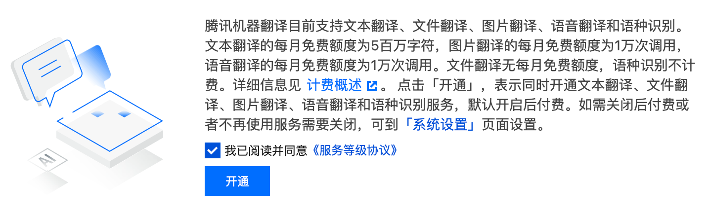

使用 **Code Actions API** 和  TextEditorDecorationType 实现对文字选中时实现翻译功能，默认用微软的翻译，在新的文件编写

1. 多行文本翻译 - 专门优化了多行文本的显示方式，为每行都添加了引导符号
2. 翻译缓存系统 - 使用MD5哈希生成缓存键，减少内存占用
3. 智能缓存管理 - 定期清理过期条目，防止内存溢出
4. 友好的进度显示 - 对大型多行文本显示翻译进度

翻译引擎切换规则 1.先看密钥有配置的优先使用它，2.github copilot 安装就使用它，3.再是免费的

腾讯云产品列表 sdk 后缀 https://github.com/TencentCloud/tencentcloud-sdk-nodejs/blob/master/products.md
